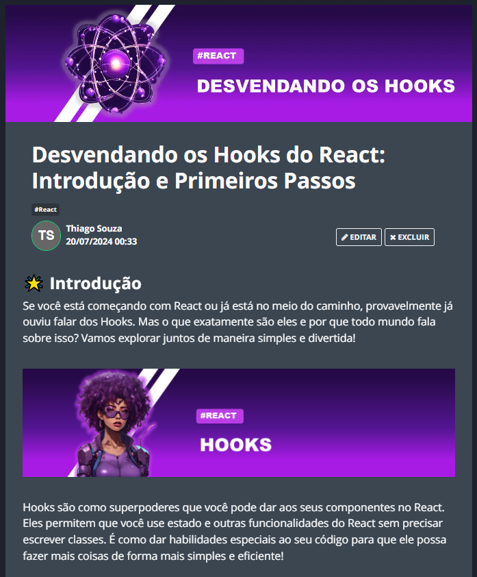

    

  
  

-------

  

# Projeto artigo técnico gerado por I.A.s

Projeto com o objetivo de gerar um artigo técnico com um layout rico, leitura agradável e com foco em promover sua autoridade técnica.

<a href="https://web.dio.me/articles/desvendando-os-hooks-do-react-introducao-e-primeiros-passos?back=%2Farticles&open-modal=true&page=1&order=oldest" title="View PDF now"> 📕Clique aqui para ler o artigo</a>

## 💻 Tecnologias utilizadas no projeto

- [ChatGPT](https://chat.openai.com/) - para título e conteúdo
- [Lexica.art](https://lexica.art/) - para gerar imagens
- [PowerPoint](https://www.microsoft.com/en/microsoft-365/powerpoint) - Para formatação de banners e Layouts

## 📄 Prompts e ferramentas

ChatGPT：

|   Ação   | prompt                                                                                                                                                                                                                                                                         |
| :------: | ------------------------------------------------------------------------------------------------------------------------------------------------------------------------------------------------------------------------------------------------------------------------------ |
|  Assunto  | Crie 10 headlines para nomes de artigos sobre o assunto React - Hooks                                                                                                                                                                                                    |
| conteúdo | Comporte-se com um escritr de artigos tech front end e escreva o Artigo atendendo as regras abaixo

{REGRAS}
> No máximo 5 linhas por blocos de explicação

> Me explique de maneira informal, como se fosse um programador iniciante

> Os blocos que serão criados estão abaixo:
- O que são Hooks
- Quais são as suas funções
- Cite exemplos de cada hook
- Hooks essenciais 
- Faça uma conclusão e cite minhas redes sociais
- Coloque 3 hashtags que façam sentido |

Lexica.art：

- No léxica utilizamos o acervo público de imagens geradas por outras pessoas, os termos de pesquisa que utilizei durante a gravação do conteúdo foram:

• React

## ✨ Features

- Conteúdo gerado via ChatGPT
- Imagens do acervo público geradas via Lexica.art

## 📚 Materiais

- prompts utilizados

## 👨‍💻 Expert

    
    
&nbsp&nbsp&nbspThiago Souza 
    &nbsp&nbsp&nbsp
    <a href="https://github.com/Mctks2">
    GitHub</a>&nbsp;|&nbsp;
    <a href="https://www.linkedin.com/in/thiago-souza-8b492b149/">LinkedIn</a>
&nbsp;|&nbsp;
    <a href="https://www.instagram.com/tkcamargo/">
    Instagram</a>
&nbsp;|&nbsp;

  

